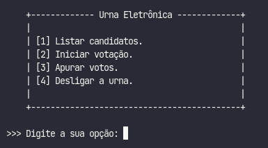

# URNA ELETRÔNICA

### Sobre

Este projeto foi baseado em um trabalho requisitado pela disciplina de **Projeto Integrador** do curso de **Análise e Desenvolvimento de Sistemas** no [Unilavras - Centro Universitário de Lavras](https://unilavras.edu.br/). A ideia era desenvolver, em versões, uma urna eletrônica de acordo com a evolução nas disciplinas de **Algoritmos e Programação** e **Estrutura de Dados**, adicionando novas funcionalidades a cada versão.


<br/>

### 📌 Conteúdo

* [Sobre](#sobre)
* [Status](#status)
* [Características](#características)
* [Requisitos](#requisitos)
* [Tecnologia](#tecnologia)
* [Autores](#autores)
* [Licença](#licença)
<br/>

### Status

Projeto em construção 🛠️
<br/>

### Características

- [x] Menus de interação
- [x] Listagem de candidatos
- [x] Votação para governador e presidente
- [x] Apuração dos votos
- [x] Desligamento da urna
<br/>

### Requisitos

1. Para rodar a aplicação é necessário a instalação do [Python 3](https://www.python.org/downloads/).

2. O próximo passo é clonar este repositório para algum local do computador
por meio do terminal ou cmd:

```bash
    $ git clone https://github.com/MatheusBibiano/Urna-Eletronica.git
```

3. Feito isso, agora é só navegar para dentro da pasta do projeto e executar:

* Linux
```bash
    $ python3 main.py
```

* Windows
```powershell
    $ python main.py
```
<br/>

### Tecnologia

A seguinte tecnologia foi utilizada na construção do projeto:

- [Python](https://www.python.org/)
<br/>

### Autores

| Matheus Bibiano                                       | Matheus Cereda |
|-------------------------------------------------------|--------------------------------------------------------|
| | |
| [](https://www.linkedin.com/in/matheus-bibiano-alves)|[](https://www.linkedin.com/in/matheus-henrique-cereda-monteiro-448b78223/)|
<br/>

### Licença

[MIT](https://choosealicense.com/licenses/mit/)
